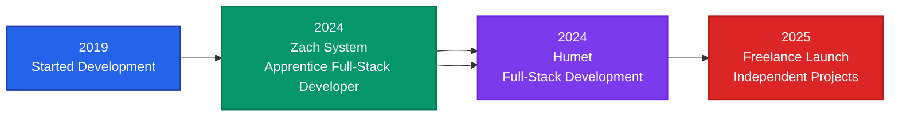

<div align="center">

# Gaëtan Bougoula

### Full-Stack Developer

[](https://gaetanbougoula.fr)
[](https://www.linkedin.com/in/gaëtan-bougoula/)
[](mailto:gaetan.bougoula@orange.fr)
[](https://github.com/Kuro250104)

</div>

---

## Professional Profile

```typescript
const developer = {
    name: "Gaëtan Bougoula",
    role: "Full-Stack Developer",
    experience: "6+ years",
    education: "Master 1 - Full-Stack Development",
    current: {
        position: "Full-Stack Developer @ Humet",
        status: "Available for Freelance Projects & Collaborations"
    },
    expertise: [
        "E-commerce Solutions",
        "Corporate Websites",
        "Portfolio Platforms",
        "Custom Web Applications"
    ],
    methodology: ["Agile", "Microservices", "REST APIs"]
};
```

---

## Technical Stack

### Core Technologies

<div align="center">

#### Frontend Development


#### Styling & Design


#### Backend Development


#### Mobile Development


#### Database & Storage


#### DevOps & Tools


</div>

---

## Technical Expertise

<div align="center">

| Category | Technologies | Proficiency |
|----------|-------------|-------------|
| **Frontend** | Next.js, React, TypeScript | ████████████ Expert |
| **Styling** | TailwindCSS, HTML/CSS | ████████████ Expert |
| **Backend** | Django, Laravel, Node.js | ██████████░░ Advanced |
| **Database** | PostgreSQL, MongoDB, SQL | ██████████░░ Advanced |
| **Mobile** | Kotlin | ████████░░░░ Intermediate |
| **Design** | Figma, UI/UX | ██████████░░ Advanced |

</div>

---

## Professional Timeline



---

## GitHub Statistics

<div align="center">


</div>

<div align="center">


</div>

---

## Contribution Activity

<div align="center">


</div>

---


##  Collaboration Opportunities

I'm actively seeking:

- **Freelance Projects** - E-commerce, corporate sites, custom applications
- **Project Collaborations** - Open-source contributions and team projects
---

## Get In Touch

<div align="center">

**Available for freelance projects and professional collaborations**

[](https://gaetanbougoula.fr)
[](https://www.linkedin.com/in/gaëtan-bougoula/)
[](mailto:gaetan.bougoula@orange.fr)

</div>


</div>
